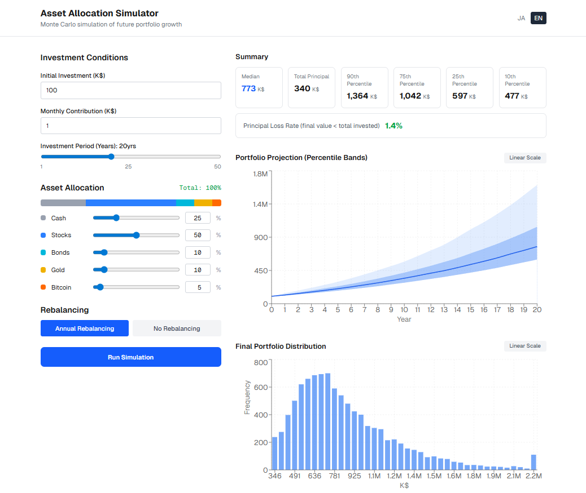

# Asset Allocation Simulator

Monte Carlo portfolio simulator. Input your initial investment, monthly contribution, investment horizon, and asset allocation — the simulator runs 10,000 paths and visualizes the range of possible outcomes.



---

## Features

- **Monte Carlo simulation** — 10,000 paths with correlated multi-asset returns (Cholesky decomposition)
- **Percentile band chart** — p5/p25/p50/p75/p95 over time (linear or log scale)
- **Final value histogram** — distribution of outcomes at the end of the investment period
- **Summary statistics** — median, 10th/25th/75th/90th percentile, principal loss probability
- **Correlation matrix** — measured from real historical data (Stooq monthly closing prices)
- **Annual rebalancing** toggle
- **Japanese / English** bilingual (`/ja`, `/en`)
- Runs entirely in the browser — Web Worker offloads computation from the main thread

## Asset Classes

| Asset | Proxy | Annual Return | Std Dev | Data Period |
|-------|-------|--------------|---------|-------------|
| Cash | — | 0.1% | 0.1% | — |
| Foreign Stocks | SPY (S&P 500 ETF) | 8% | 18% | 2005–2024 |
| Japan Stocks | ^TPX (TOPIX) | 6% | 19% | 2005–2024 |
| Bonds | AGG (US Agg Bond ETF) | 2.5% | 5.5% | 2005–2024 |
| Gold | GLD (Gold ETF) | 6% | 17% | 2005–2024 |
| Bitcoin | BTC-USD | 30% | 70% | 2015–2024 |

Correlation values are computed from Stooq monthly closing prices. All parameters are hardcoded in [`src/lib/asset-data.ts`](src/lib/asset-data.ts).

## Getting Started

```bash
npm install
npm run dev      # http://localhost:3000
```

## Commands

```bash
npm run dev      # Dev server
npm run build    # Production build
npm run lint     # ESLint
```

## Tech Stack

- **Next.js 15** (App Router) + **TypeScript**
- **Tailwind CSS v4**
- **Recharts** — charts
- **next-intl** — i18n (`/ja` default, `/en`)
- **Web Worker** — Monte Carlo simulation off the main thread

## Project Structure

```
src/
├── app/[locale]/              # Routes (/ja, /en)
├── components/                # UI components
├── lib/
│   ├── asset-data.ts          # Return, std dev, correlation matrix — edit here to update data
│   ├── cholesky.ts            # Cholesky decomposition
│   └── monte-carlo.ts         # Core simulation logic
├── workers/
│   └── monte-carlo.worker.ts  # Web Worker entry point
├── messages/
│   ├── ja.json                # Japanese strings
│   └── en.json                # English strings
└── types/index.ts
```

## Deploy

```bash
vercel deploy
```
